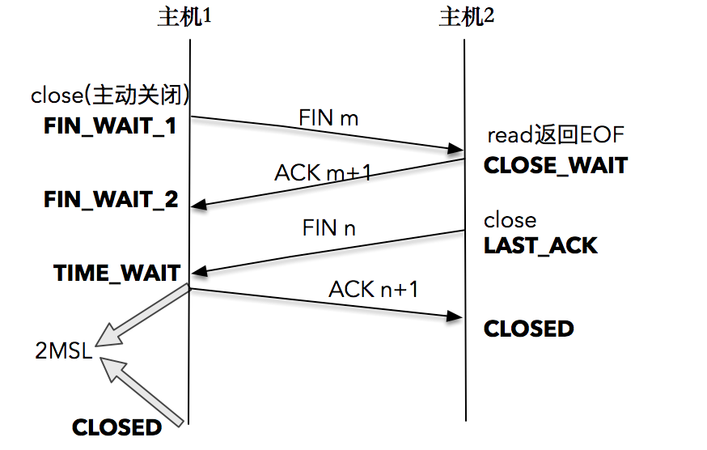

# netowrk

## buffer

发送成功仅仅表明数据被拷贝到了发送缓冲区，并不意味着对端已经收到所有的数据。

## 三次握手

确保各自的手法能力是正常的

## 四次挥手

只有发起连接终止的一方会进入TIME_WAIT状态，TIME_WAIT可以确保对方能够收到最后的ACk，帮助其关闭，并且可以防止迷走报文对程序带来影响。
RFC 1323 中引入了新的TCP选项，两个4字节的时间戳字段，用于记录TCP发送方的当前时间戳和从对端接收到的最新时间戳。由于引入了时间戳，我们在前面提到的2MSL问题就不复存在了，因为重复的数据包会因为时间戳过期被自然丢弃。
可通过设置net.ipv4.tcp_tw_reuse=1、net.ipv4.tcp_timestamps=1开启，使连接发起方TIME_WAIT状态的连接创建时间超过1秒才可以被复用。